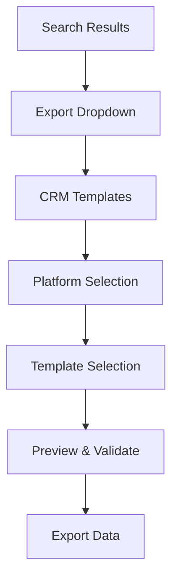

# CRM Export Templates Guide


## 📋 Overview

The CRM Export Templates feature provides platform-specific export functionality for major CRM systems including Salesforce, HubSpot, and Pipedrive. This comprehensive guide covers all aspects of using and managing CRM export templates.

## 🎯 Key Features

### **Platform-Specific Templates**
- **Salesforce**: Lead and Account/Contact templates with picklist transformations
- **HubSpot**: Contact and Company templates with lifecycle stages and JSON support
- **Pipedrive**: Organization/Person and Deals templates with currency normalization

### **Advanced Transformation Engine**
- Dynamic field mapping with dot notation support
- Comprehensive validation with type checking and custom rules
- Built-in transformers for common data formats
- Error handling with graceful degradation

### **Template Management**
- Built-in templates for common use cases
- Custom template creation and modification
- Template import/export functionality
- Local storage persistence with validation

## 🚀 Getting Started

### **Accessing CRM Export Templates**

1. **Navigate to Results**: Complete a business search to generate results
2. **Open Export Options**: Click the "Export" dropdown in the results table
3. **Select CRM Templates**: Click "🚀 CRM Templates" option
4. **Choose Platform**: Select your CRM platform (Salesforce, HubSpot, or Pipedrive)

### **Basic Export Workflow**



## 🔧 Platform-Specific Guides

### **Salesforce Export**

#### **Available Templates**
- **Salesforce Lead (Basic)**: Essential lead fields with industry mapping
- **Salesforce Account & Contact**: B2B data with account and contact separation

#### **Field Mappings**
| Business Field | Salesforce Field | Transformation |
|----------------|------------------|----------------|
| businessName | Company | Direct mapping |
| email | Email | Email validation |
| phone | Phone | Phone formatting |
| industry | Industry | Industry mapping |
| address | Street | Address parsing |

#### **Example Export**
```csv
Company,Email,Phone,Industry,Street,City,State,PostalCode,LastName,LeadSource
"Tech Startup Inc","contact@techstartup.com","(555) 123-4567","Technology","123 Innovation Dr","San Francisco","CA","94105","Tech Startup Inc Contact","Web"
```

### **HubSpot Export**

#### **Available Templates**
- **HubSpot Contact (Basic)**: Contact-focused template with lifecycle stages
- **HubSpot Company & Contact**: JSON structure for bulk import

#### **Field Mappings**
| Business Field | HubSpot Field | Transformation |
|----------------|---------------|----------------|
| businessName | Company name | Direct mapping |
| email | Email | Required field validation |
| phone | Phone Number | Phone formatting |
| industry | Industry | HubSpot industry codes |
| confidence | Lifecycle Stage | Confidence-based mapping |

#### **Example Export (JSON)**
```json
{
  "metadata": {
    "exportDate": "2025-08-25T10:00:00.000Z",
    "platform": "hubspot",
    "totalRecords": 1
  },
  "records": [
    {
      "Email": "contact@business.com",
      "First Name": "Business",
      "Last Name": "Contact",
      "Company name": "Example Business",
      "Phone Number": "(555) 123-4567",
      "Lifecycle Stage": "lead"
    }
  ]
}
```

### **Pipedrive Export**

#### **Available Templates**
- **Pipedrive Organization & Person**: Basic organization and person data
- **Pipedrive Deals (Complete)**: Full deal pipeline with estimated values

#### **Field Mappings**
| Business Field | Pipedrive Field | Transformation |
|----------------|-----------------|----------------|
| businessName | Organization Name | Direct mapping |
| email | Person Email | Email validation |
| phone | Person Phone | Phone formatting |
| confidence | Deal Value | Confidence-based estimation |
| industry | Deal Currency | Default to USD |

#### **Example Export**
```csv
Organization Name,Person Name,Person Email,Deal Title,Deal Value,Deal Stage
"Local Restaurant","Local Restaurant Contact","info@restaurant.com","Local Restaurant - Restaurants Opportunity","15000.00","Lead In"
```

## 🎨 Template Management

### **Using Built-in Templates**

1. **Browse Templates**: View available templates for your selected platform
2. **Template Details**: Review field mappings and descriptions
3. **Preview Data**: See how your data will be transformed
4. **Validate Export**: Check for errors and warnings before export

### **Creating Custom Templates**

#### **Template Structure**
```typescript
interface CRMTemplate {
  id: string
  name: string
  platform: 'salesforce' | 'hubspot' | 'pipedrive'
  description: string
  exportFormat: 'csv' | 'json' | 'xml'
  fieldMappings: CRMFieldMapping[]
  validation: ValidationSettings
}
```

#### **Field Mapping Configuration**
```typescript
interface CRMFieldMapping {
  sourceField: string        // e.g., 'businessName' or 'address.city'
  targetField: string        // e.g., 'Company' or 'Organization Name'
  transformer?: Function     // Optional data transformation
  defaultValue?: any         // Default if source is empty
  required?: boolean         // Whether field is required
  validation?: ValidationRule // Field validation rules
}
```

### **Template Import/Export**

#### **Exporting Templates**
```bash
# Templates are automatically saved to localStorage
# Export functionality available in template manager UI
```

#### **Importing Templates**
```json
{
  "id": "custom-salesforce-template",
  "name": "Custom Salesforce Template",
  "platform": "salesforce",
  "description": "Custom template for specific use case",
  "exportFormat": "csv",
  "fieldMappings": [
    {
      "sourceField": "businessName",
      "targetField": "Company",
      "required": true,
      "validation": {
        "required": true,
        "type": "string",
        "maxLength": 255
      }
    }
  ]
}
```

## 🔍 Data Validation and Preview

### **Real-Time Validation**

The system provides comprehensive validation before export:

- **Required Field Validation**: Ensures all required CRM fields are populated
- **Data Type Validation**: Validates email formats, phone numbers, dates
- **Length Validation**: Checks field length limits for target CRM
- **Custom Validation**: Platform-specific validation rules

### **Preview Functionality**

#### **Preview Features**
- **Sample Data**: Shows first 3-5 transformed records
- **Error Reporting**: Lists validation errors with field details
- **Warning System**: Highlights potential issues
- **Statistics**: Shows total/valid/invalid record counts

#### **Example Preview Output**
```
Preview Results:
✅ Total Records: 100
✅ Valid Records: 95
❌ Invalid Records: 5
⚠️  Warnings: 12

Errors Found:
- Record 23: Email field 'invalid-email' is not a valid email address
- Record 45: Company field is required but empty
- Record 67: Phone field '123' is too short for phone validation

Warnings:
- Record 12: Industry 'unknown' mapped to 'Other'
- Record 34: Address field is empty, will use default
```

## 🚀 Advanced Features

### **Batch Processing**

The system efficiently handles large datasets:

- **Progress Tracking**: Real-time progress updates
- **Memory Management**: Efficient processing for large exports
- **Error Recovery**: Continues processing despite individual record errors
- **Performance Metrics**: Processing time and throughput statistics

### **Custom Transformers**

#### **Built-in Transformers**
- `formatPhone`: Formats phone numbers to (555) 123-4567
- `formatEmail`: Validates and normalizes email addresses
- `formatCurrency`: Converts to currency format with proper decimals
- `formatDate`: Converts dates to ISO or custom formats
- `toUpperCase`/`toLowerCase`: Text case transformations

#### **Creating Custom Transformers**
```typescript
const customTransformer = (value: any, record: BusinessRecord): string => {
  // Custom transformation logic
  return transformedValue
}
```

### **Error Handling**

#### **Error Types**
- **Validation Errors**: Field validation failures
- **Transformation Errors**: Data transformation failures
- **System Errors**: Technical processing errors

#### **Error Recovery**
- **Skip Invalid Records**: Continue processing valid records
- **Default Values**: Use fallback values for missing data
- **Graceful Degradation**: Maintain functionality despite errors

## 📊 Performance and Optimization

### **Performance Characteristics**

- **Processing Speed**: 1000+ records per second
- **Memory Usage**: Optimized for large datasets
- **Export Size**: Supports exports up to 100,000+ records
- **Response Time**: Real-time preview for datasets under 1000 records

### **Optimization Tips**

1. **Use Appropriate Templates**: Choose templates that match your data structure
2. **Validate Early**: Use preview functionality to catch errors before full export
3. **Batch Large Exports**: Consider splitting very large datasets
4. **Monitor Progress**: Use progress tracking for long-running exports

## 🔧 Troubleshooting

### **Common Issues**

#### **Export Fails with Validation Errors**
- **Solution**: Use preview functionality to identify and fix validation errors
- **Prevention**: Ensure required fields are populated in source data

#### **Slow Export Performance**
- **Solution**: Check dataset size and consider batching
- **Prevention**: Use appropriate hardware and close unnecessary applications

#### **Missing Field Mappings**
- **Solution**: Verify template field mappings match your data structure
- **Prevention**: Use template preview to validate mappings before export

### **Error Messages**

| Error | Cause | Solution |
|-------|-------|----------|
| "Required field missing" | Required CRM field not mapped | Add mapping for required field |
| "Invalid email format" | Email validation failed | Correct email format in source data |
| "Template not found" | Template ID invalid | Verify template exists and ID is correct |
| "Platform not supported" | Invalid CRM platform | Use supported platform (Salesforce, HubSpot, Pipedrive) |

## 📚 Related Documentation

- **[CRM Template Creation Guide](CRM_TEMPLATE_CREATION.md)**: Detailed guide for creating custom templates
- **[CRM Troubleshooting Guide](CRM_TROUBLESHOOTING.md)**: Common issues and solutions
- **[API Documentation](API_DOCUMENTATION.md)**: Technical API reference
- **[User Guide](USER_GUIDE.md)**: General application usage guide

## 🎯 Best Practices

### **Template Selection**
- Choose templates that match your CRM workflow
- Use built-in templates as starting points for customization
- Test templates with sample data before production use

### **Data Preparation**
- Ensure data quality before export
- Validate email addresses and phone numbers
- Standardize industry and category information

### **Export Management**
- Use descriptive filenames for exports
- Maintain export logs for audit purposes
- Test imports in CRM sandbox environments first

## 📞 Support

For additional support with CRM export templates:

- **Documentation Issues**: Create an issue with the `documentation` label
- **Feature Requests**: Submit enhancement requests through the issue tracker
- **Technical Support**: Contact the development team for technical assistance
